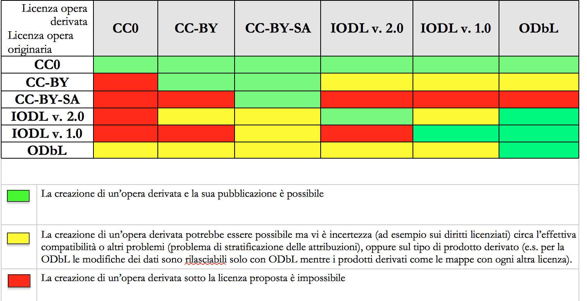

Aspetti legali e di costo
=========================

Licenze
-------

.. note::
 **AZIONE 12: ASSICURATI DI ASSEGNARE UNA LICENZA AI DATASET...**

 **L’informazione sul tipo di licenza è metadato indispensabile per determinare come poter riutilizzare il dataset. Deve pertanto essere sempre specificata indicando, il nome, la versione e fornendo il riferimento al testo della licenza**.

 Nel contesto dei dati aperti, considerando la definizione Open Data fornita dal CAD e dall’Open Knowledge Foundation (OKFN), per cui un dato è aperto se è “*liberamente usabile, riutilizzabile e ridistribuibile da chiunque per qualsiasi scopo, soggetto al massimo alla richiesta di attribuzione e condivisione allo stesso modo*, le sole licenze ammesse per abilitare l’effettivo paradigma dell’Open Data sono classificate come mostrato in Figura 6.

 Come evidenziato in Figura 6, **tutte le licenze che non consentono lavori derivati, anche per finalità commerciali, i.e., licenze che riportano chiaramente clausole Non Commercial - NC e/o Non Derivative – ND e/o ogni altra clausola che limita la possibilità di riutilizzo e ridistribuzione dei dati, non possono essere ritenute valide per identificare dataset aperti**.

.. figure:: _images/Licenze.png
     :width: 75%
     :align: center
     :alt: Figura 7: Licenze aperte e non aperte per i dataset

     Figura 7: Licenze aperte e non aperte per i dataset

La Figura 7 mostra le licenze più usate per l’Open Data. Esse appartengono a tre categorie principali:

     1. il pubblico dominio o “waiver” [4]_ dove il dichiarante “apertamente, pienamente, permanentemente, irrevocabilmente e incondizionatamente rinuncia, abbandona e cede ogni proprio diritto d’autore e connesso, ogni relativa pretesa, rivendicazione, causa e azione, sia al momento nota o ignota (includendo espressamente le pretese presenti come quelle future) relativa all’opera”. Rientrano in questa categoria la CC0 della famiglia delle licenze internazionali `Creative Commons <http://creativecommons.org>`__ e la `Open Data Commons – Public Domain Dedication License (ODC-PDDL) <http://opendatacommons.org/licenses/pddl/summary/>`__ per i dataset/database;
     2. le licenze per l’open data con richiesta di attribuzione, che consentono di condividere, adattare e creare anche per finalità commerciali con il solo vincolo di attribuire la paternità del dataset. Rientrano in questa categoria la licenza CC-BY della famiglia `Creative Commons <http://creativecommons.org>`__, la `IODL (Italian Open Data License) nella sua versione 2.0 <http://www.dati.gov.it/iodl/2.0/>`__ e la `Open Data Commons Attribution License (ODC-BY) <http://opendatacommons.org/licenses/by/summary/>`__ per dataset/database .
     3. le licenze per l’open data con richiesta di attribuzione e condivisione allo stesso modo, che consentono di condividere, adattare e creare anche per finalità commerciali nel rispetto però di due vincoli: a) attribuire la paternità del dataset; b) distribuire eventuali lavori derivati con la stessa licenza che governa il lavoro originale. Rientrano in questa categoria la licenza CC-BY-SA della famiglia Creative Commons la `IODL nella sua versione 1.0 <http://www.formez.it/iodl/>`__ e la `Open Data Commons Open Database License (ODbL) <http://opendatacommons.org/licenses/odbl/>`__ utilizzata dal progetto OpenStreetMap (OSM).

.. note::
  In relazione a quanto sopra riportato, tenuto conto del contesto normativo di riferimento, delle indicazioni in tema di licenze contenute nella Comunicazione della Commissione 2014/C  - 240/01 e dei principi di indisponibilità dei beni del demanio culturale espresso negli artt. 10 e 53 del Codice dei beni culturali (D.lgs. 22 gennaio 2004, n. 42), **si ritiene opportuno fare riferimento ad una licenza unica aperta, che garantisca libertà di riutilizzo, che sia internazionalmente riconosciuta e che consenta di attribuire la paternità dei dataset (attribuire la fonte). Pertanto, si suggerisce l’adozione generalizzata della licenza CC-BY nella sua versione 4.0, presupponendo altresì l’attribuzione automatica di tale licenza nel caso di applicazione del principio “Open Data by default”, espresso nelle disposizioni contenute nell’articolo 52 del CAD.**

  Si raccomanda inoltre di gestire l’attribuzione della fonte indicando il nome dell’organizzazione unitamente all’URL della pagina Web dove si trovano i dataset/contenuti da licenziare.
  Nell’applicazione della licenza si ricorda che **non si può disporre/attribuire diritti più ampi rispetto alla licenza di partenza** (e.g., non si può attribuire un pubblico dominio - o waiver - a un dataset ottenuto da una fonte a cui è associata una licenza che richiede attribuzione).

  Infine, le amministrazioni possono prevedere casi di applicazione di licenze che limitino il riutilizzo dei dati **se e solo se** ciò si renda necessario  per il rispetto di altre normative (e.g., norme in materia di protezione dei dati personali) e **comunque motivando opportunamente la scelta**.

A completamento dell’argomento, si evidenzia l’opportunità di verificare gli aspetti relativi a:

     + titolarità dei dati secondo la competenza amministrativa;
     + elaborazione di un’opera derivata, con il conseguente onere di citazione della fonte originale del dataset e di specifica attribuzione all’opera derivata;
     + finalità per i quali i dati sono stati creati che eventualmente non consentono di renderli automaticamente disponibili in open data;
     + responsabilità del titolare rispetto al riutilizzo dei dati da parte di terzi

e, nel caso, specificare una nota legale, che integra e accompagna la licenza.

Compatibilità tra licenze
^^^^^^^^^^^^^^^^^^^^^^^^^
Un’indicazione di compatibilità tra le licenze Open Data è riportata di seguito [5]_:

.. rubric:: Note

.. [4]
  Essendo internazionale, è assoggettato ai vincoli imposti dal diritto nazionale, è bene quindi verificare la sua compatibilità con il contesto in cui si utilizza.

.. [5]
  Lo schema proposto in tabella è tratto principalmente da: Federico Morando, “Interoperabilità giuridica: rendere i dati (pubblici) aperti compatibili con imprese e comunità online”, JLIS.it Italian Journal of Library and Information Science, Gennaio 2013, http://leo.cineca.it/index.php/jlis/article/download/5461/7928 e modificato secondo gli aggiornamenti delle licenze considerate.

Aspetti di costo del dato
-------------------------

.. note::
  **AZIONE 13: DEFINISCI GLI ASPETTI DI COSTO PER I DATI ...**

  Premesse le azioni di **condivisione dei dati tra pubbliche amministrazioni per finalità istituzionali (art. 50 del CAD), che avvengono esclusivamente a titolo gratuito**, nel caso dell’**Open Data** si suggerisce **azioni volte a renderli disponibili esclusivamente a titolo gratuito**. Tuttavia, è prevista la possibilità di **richiedere per il riutilizzo dei dati un corrispettivo specifico, limitato ai costi sostenuti effettivamente per la riproduzione, messa a disposizione e divulgazione dei dati**. In tali casi, come previsto dall’art. 7 del D.Lgs 24 gennaio 2006, n. 36, AgID determina, su proposta motivata del titolare del dato,  le tariffe standard da applicare, pubblicandole sul proprio sito istituzionale.
  Nel pieno rispetto dei principi di trasparenza e verificabilità, tali tariffe sono determinate sulla base del “Metodo dei costi marginali” esplicitato nella Comunicazione della Commissione 2014/C - 240/01 contenente, tra gli altri, gli orientamenti sulla tariffazione.

In linea con quanto previsto dalla direttiva comunitaria, il citato articolo 7 del D. Lgs. 36/2006 prevede inoltre casi specifici per i quali è possibile determinare tariffe superiori ai costi marginali in deroga al principio generale di rendere disponibili i dati gratuitamente o a costi marginali, ovvero:

  1. alle biblioteche, comprese quelle universitarie, di musei e archivi;
  2. alle amministrazioni e agli organismi di diritto pubblico che devono generare utili per coprire una parte sostanziale dei costi inerenti allo svolgimento dei propri compiti di servizio pubblico;
  3. ai casi eccezionali relativi a documenti per i quali le pubbliche amministrazioni e gli organismi di diritto pubblico sono tenuti a generare utili sufficienti per coprire una parte sostanziale dei costi di raccolta, produzione, riproduzione e diffusione.

In tutti i tre casi, i Ministeri competenti, di concerto con il Ministero dell’economia e delle finanze, sentita AgID, determinano, con appositi decreti, i criteri generali per le tariffe e le relative modalità di versamento, mantenendo aggiornate le stesse ogni due anni. Nel primo caso, l’importo delle tariffe comprende i costi di raccolta, produzione, riproduzione, diffusione, conservazione e gestione dei diritti, maggiorati, nel caso di riutilizzo per fini commerciali, di un congruo utile da determinarsi in relazione alle spese per investimenti sostenute nel triennio precedente. Negli altri due casi l’importo delle tariffe comprende i costi di raccolta, produzione, riproduzione, diffusione, maggiorati di un congruo utile, da determinarsi con appositi decreti, nei casi di riutilizzo per fini commerciali e in relazione alle spese per investimenti sostenute nel triennio precedente. Nei tre casi di cui sopra, in presenza di riutilizzo dei dati per scopi non commerciali è prevista una tariffa differenziata da determinarsi con le modalità suddette secondo il criterio della copertura dei soli costi effettivi sostenuti dalle amministrazioni.
Alla data di pubblicazione delle presenti linee guida, non si riscontrano ancora casi specifici di applicazione dei suddetti principi di tariffazione.

.. note::
  **Nei casi eccezionali di applicazione di tariffe superiori ai costi marginali, va tenuto conto delle indicazioni contenute nella Comunicazione della Commissione 2014/C - 240/01, “Metodo del recupero dei costi”. Inoltre, è possibile avvalersi di metodi di analisi dei costi** (e.g., Activity Based Costing, che assegna costi ai prodotti, servizi, progetti e compiti sulla base sia delle attività svolte per gli stessi sia delle risorse consumate per tali attività) **che siano oggettivi, trasparenti e verificabili**. A seguito di tale analisi, l'amministrazione può considerare un modello di business per la determinazione delle tariffe. Un elenco non esaustivo di possibili modelli di business è riportato nelle `linee guida per la valorizzazione del patrimonio informativo pubblico (anno 2014) <http://www.agid.gov.it/sites/default/files/linee_guida/patrimoniopubblicolg2014_v0.7finale.pdf>`__. Questi modelli sono stati presentati nel progetto europeo Share-PSI 2.0, nell’ambito del workshop `“A Self Sustaining Business Model for Open Data” <https://www.w3.org/2013/share-psi/workshop/krems/report>`__ e possono ancora essere considerati un riferimento per gli scopi del presente aggiornamento delle linee guida.
