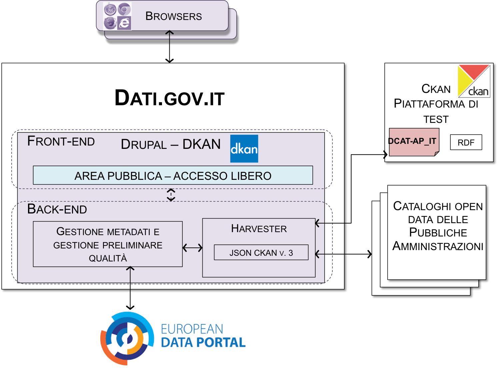
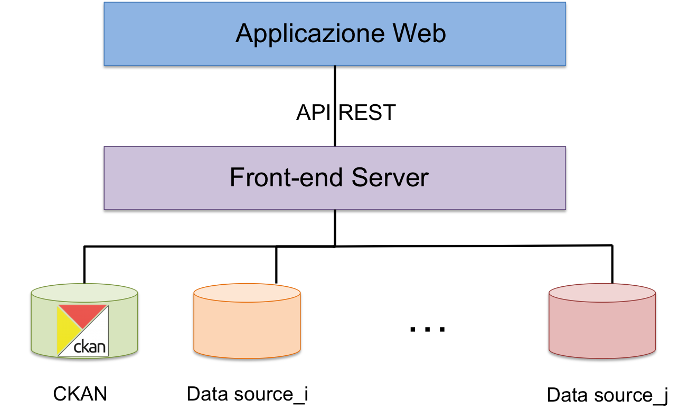

Pubblicazione e dati.gov.it
===========================

Pubblicazione dei dati
----------------------

.. note::
 **AZIONE 14: PUBBLICA I DATI MA SOLO DOPO AVER COMPLETATO LE AZIONI PRECEDENTI...**

 Prima di pubblicare i dati, assicurati di aver completato queste azioni precedenti e quindi:

 + `AZIONE 1 <normativa.html>`__ e `AZIONE 2 <dati.html>`__ : di aver chiari i principi delle normative in materia di dati pubblici e loro riutilizzo;
 + `AZIONE 3 <modellodati.html>`__ e `AZIONE 4 <modellometadati.html>`__: di aver compreso e selezionato il livello più appropriato del modello per i dati e i metadati , tenendo conto che il requisito minimo per i dati è il livello 3;
 + `AZIONE 6 – censimento <aspettiorg.html#linea-1-dati-nativi>`__: di aver identificato nel censimento dei dati la domanda e l’impatto sociale ed economico che possono e riescono a generare;
 + `AZIONE 6 – analisi giuridica delle fonti <aspettiorg.html#linea-1-dati-nativi>`__: di aver verificato eventuali limitazioni giuridiche (proprietà dei dati, privacy, ecc.);
 + `AZIONE 5 <modellometadati.html#profilo-nazionale-per-i-metadati-dcat-ap-it>`__: di aver predisposto i metadati secondo il profilo DCAT-AP_IT;
 + `AZIONE 9 <aspettiorg.html#qualita-dei-dati>`__: di aver pianificato le attività in modo da mantenere i dati costantemente aggiornati e da garantire altri aspetti di qualità (i.e.., completezza, accuratezza, coerenza);
 + `AZIONE 10 <arch.html>`__: di aver descritto i dati di riferimento e "core" secondo i modelli indicati nell’architettura di riferimento per l’informazione del settore pubblico;
 + `AZIONE 11 <arch.html#formati-aperti-per-i-dati-e-documenti>`__: di aver predisposto i dati con almeno un formato aperto machine-readable;
 + `AZIONE 12 <licenzecosti.html>`__: di aver assegnato una licenza aperta, possibilmente quella raccomandata dalle presenti linee guida (CC-BY 4.0).

 Durante la fase di pubblicazione è necessario **garantire agli utenti la possibilità di ottenere i dati in bulk, ovvero fornirli in blocco in un file o insieme di file, senza richiedere credenziali di accesso (a meno di farlo per mere iniziative conoscitive dell’utenza che dovranno essere comunque esplicitate, dando all’utente la possibilità di rifiutare e/o rimanere anonimo)**, e di **interrogare il dato mediante la messa a disposizione di API (Application Programming Interface)** che possono essere usate anche per acquisire piccole porzioni dei dati.
 Nel caso di pubblicazione di **LOD è necessario garantire che gli URI dei dati siano persistenti e deferenziabili e che uno SPARQL endpoint sia presente per abilitare funzioni di interrogazione**.
 Infine, assicurati di documentare i dati pubblicati in dati.gov.it (`AZIONE 15 <publdatigov.html#dati-gov-it>`__).

Elementi architetturali
^^^^^^^^^^^^^^^^^^^^^^^

I principali livelli architetturali che compongono una soluzione per la pubblicazione e interrogazione di dati aperti possono essere istanziati in diverso modo a seconda delle capacità economiche e tecniche delle amministrazioni, nonché della qualità del servizio che si vuole offrire agli utenti. Si distinguono due livelli: livello di front-end e livello infrastrutturale.
Il livello di front-end consiste di una parte di presentazione che può essere sia un sito Web, sia una sezione in un sito esistente. In questa parte rientrano tutti quegli strumenti che consentono di (i) dare massima visibilità ai dataset disponibili e (ii) di interagire in maniera “user-friendly” con gli utenti stessi, per esempio per capire quali dati sono di loro interesse, quali nuovi dati sono richiesti, quali suggerimenti vogliono dare per migliorare anche la qualità dei dati.
Il livello di presentazione si completa con l’interfaccia di accesso via Web per interrogazioni puntuali sui dati e metadati. Questa ha come obiettivo quello di aumentare l’interazione machine-to-machine attraverso il dispiegamento di una piattaforma di esposizione dati basata su API di servizio (o Open Data Service). Nel caso di dati dei livelli 4 e 5 del modello per i dati, l’interfaccia di accesso via Web è rappresentata dallo SPARQL endpoint.

In generale, si raccomanda di:

.. note::
  + assegnare ai dataset nomi autoesplicativi per comprenderne il principale contenuto;
  + fornire, ove possibile, descrizioni testuali dei dataset;
  + mettere in evidenza la licenza in uso in forma “human e machine-readable”;
  + fornire, ove possibile, strumenti di visualizzazione e navigazione, anche georiferita, dei dati, che possano facilitare la lettura degli stessi;
  + fornire, ove possibile, statistiche di uso, accesso e produzione;
  + fornire notifiche di cambiamenti nel sito web, di aggiornamenti ai dataset (e.g., RSS feed);
  + fornire strumenti per rendere le interrogazioni più agevoli, anche per utenti non del tutto esperti. Nel caso dei dati dei livelli 4 e 5 non si può pubblicare solo dataset RDF ma è bene mettere in evidenza la presenza dello SPARQL endpoint (i.e., servizio Web che accetta interrogazioni SPARQL, le risolve e restituisce i risultati in output), pubblicando il link di accesso, fornendo altresì un ampio insieme di “query” di esempio che con pochi click possono essere eseguite producendo risultati disponibili in diversi formati di più  comune utilizzo soprattutto nell'ambito delle comunità open data (e.g., CSV, JSON, XML).

  **Nei casi di amministrazioni di minori dimensioni o amministrazioni che non siano nelle condizioni di poter fornire un servizio con le caratteristiche sopra elencate, si consiglia di implementare azioni di sussidiarietà verticale** (ad esempio, i comuni di medio-piccole dimensioni possono riferirsi alla Regione di appartenenza) o di unirsi in iniziative comuni.

Le iniziative `OpenCoesione <http://www.opencoesione.gov.it/>`__ e `Linked Open Data della Camera dei Deputati <http://dati.camera.it/it/linked-data/>`__ offrono buoni esempi e buone pratiche per applicare le suddette raccomandazioni.

Il livello infrastrutturale è rappresentato dall’infrastruttura che ospita i dati e i metadati. Nel **caso di dati aperti**, tenuto conto della loro natura intrinseca, ovvero dati tipicamente non riferibili a singole persone e per i quali solitamente non si richiede il soddisfacimento di specifici requisiti di protezione dei dati personali, **tecnologie basate sul paradigma del cloud computing pubblico (o di comunità come il cloud del Sistema Pubblico di Connettività) possono essere facilmente impiegabili al fine di ospitare le infrastrutture per la pubblicazione di dati aperti**.

Soluzioni Open Data per i portali Web
^^^^^^^^^^^^^^^^^^^^^^^^^^^^^^^^^^^^^

.. note::
  **Si raccomanda di non creare tanti portali diversi per singole iniziative ma, ove possibile, di raccordarle** per facilitare il reperimento e il riutilizzo dei dati da parte degli utenti finali.

Di seguito si riportano alcune possibili soluzioni per la creazione di piattaforme di pubblicazione dei dati.

**Soluzione nativa.** Viene creato un portale ad-hoc o creata un'apposita sezione di un portale esistente. In questo caso, la creazione non differisce dalla creazione di un sito Web classico [6]_.

**Estensione soluzione CMS esistente.** Molto spesso l'amministrazione gestisce già un sito Web, realizzato mediante l’uso di un CMS, che vuole estendere con una sezione dedicata agli Open Data. La criticità in questo caso è data dall'aggiunta di una componente semantica all'interno della configurazione del CMS stesso. In questo ambito, merita una menzione il progetto Apache Stanbol2 che mira a dare supporto in questo senso.

**Utilizzo di piattaforme esterne.** Viene utilizzata una piattaforma che integra già funzionalità per la catalogazione, visualizzazione, ricerca e interrogazione dei dati. In alcuni casi queste piattaforme sono disponibili in modalità "*as a service*". Gli strumenti di questo tipo più utilizzati sono CKAN, DKAN, Socrata. Essi si prestano anche per essere facilmente integrati con portali già esistenti.

.. note::
  Nell'ambito del piano di `sviluppo del Data & Analytics Framework (DAF) <http://daf-piano-di-sviluppo.readthedocs.io/it/latest/index.html>`__ previsto dal piano triennale, uno `dei casi d'uso <http://daf-piano-di-sviluppo.readthedocs.io/it/latest/casi-uso/dataset-opendata-certificati.html>`__ proposti è proprio la produzione di Open Data, *certificati* in termini di qualità, in modalità "*as a service*".

Requisiti per la pubblicazione di dati di livello 4 e 5
^^^^^^^^^^^^^^^^^^^^^^^^^^^^^^^^^^^^^^^^^^^^^^^^^^^^^^^

Linked Data utilizzano URI per risolvere il problema dell'identità; gli URI devono essere persistenti e dereferenziabili.
Una politica per garantire URI persistenti e fornire aspetti di naming è proposta dalla commissione europea con il documento sulle `“10 regole per URI persistenti” <https://joinup.ec.europa.eu/sites/default/files/c0/7d/10/D7.1.3%20-%20Study%20on%20persistent%20URIs.pdf>`__.  Facendo riferimento a tale documento, per la creazione di URI persistenti sono da evitare quelli che contengano:

  + nome del progetto/ufficio/unità amministrativa che detiene la risorsa per evitare problemi derivanti dalla fine del progetto stesso o fusioni o chiusure di uffici nell’organizzazione;
  + numeri di versione;
  + identificatori esistenti che in passato sono stati utilizzati per identificare risorse differenti;
  + riferimenti generati in modo automatico e incrementale a meno che non vi sia la garanzia che il processo non venga mai più ripetuto o, se ripetuto, generi sicuramente gli stessi identificatori per gli stessi dati di input;
  + stringhe rappresentanti “query” a database;
  + estensione del file.

Sono, invece, da ritenersi buone pratiche le seguenti:

  + strutturare l’URI come segue:
        http://{dominio}/{tipo}/{concetto}/{riferimento}
		
    dove gli elementi che compongono la URI sono:

      + *Dominio*: il dominio Web su cui reperire la risorsa
      + *Tipo*: l’elemento che specifica il tipo di risorsa. Dovrebbe poter assumere un numero limitato di valori come “doc” se la risorsa identificata è un documento descrittivo, “set” se la risorsa è un dataset, “id” o “item” se la risorsa è un oggetto del mondo reale
      + *Concetto*: il tipo di un oggetto del mondo reale
      + *Riferimento*: lo specifico elemento, termine o concetto che rappresenta la risorsa

  + costruire URI per più formati al fine di identificare al meglio la risorsa
  + collegare tra loro le rappresentazioni multiple della stessa risorsa
  + implementare il codice di risposta 303 per gli oggetti del mondo reale (si veda sotto  “content negotiation” e “dereferenziazione” degli URI)
  + utilizzare servizi dedicati

.. note::
  **Si raccomanda di considerare anche la possibilità di mantenere URI persistenti mediante w3id.org** [7]_, ovvero un servizio per applicazioni Web che fornisce meccanismi sicuri e permanenti di re-direzione, garantendo l’uso di URI sempre riferibili a siti web funzionanti. Il servizio è mantenuto dal W3C Permanent Identifier Community Group.

Inoltre, facendo uso di URI HTTP per identificare le risorse RDF, si potrebbe incorrere in URI ambigue, ovvero URI che rappresentano sia entità del Web Semantico, sia risorse Web (ad esempio, pagine Web, file, ecc.). A tal riguardo occorre gestire le richieste HTTP sulla base del loro tipo: queste possono richiedere dati (e.g., l'attributo “Accept” della richiesta valorizzato con “application/rdf+xml”) oppure risorse Web (e.g., l'attributo “Accept” della richiesta valorizzato con “text/html”). Questo processo è anche detto “*content negotiation*”. Esistono strumenti quali `Pubby <http://wifo5-03.informatik.uni-mannheim.de/pubby/>`__, `ELDA <https://github.com/epimorphics/elda>`__, `LodLive <http://en.lodlive.it/>`__ che integrano nativamente la “content-negotiation”.

Infine, esistono situazioni, tipicamente con accesso da Web browser, in cui è richiesta una risorsa (non ambigua) del Web Semantico come se questa fosse una pagina HTML. In questi casi si può rispondere all'utente con una pagina Web informativa relativa alle informazioni associate all'entità identificata con quell'URI. Questa operazione è detta *dereferenziazione* degli URI.

.. note::
  Il W3C ha pubblicato un rapporto tecnico dettagliato sulla dereferenziazione delle URI [8]_ e sulla “content negotiation” al quale si consiglia di far riferimento.

.. rubric:: Note

.. [6]
  Si raccomanda di applicare le raccomandazioni delle linee guida per i servizi Web della PA https://design-italia.readthedocs.io/it/stable/index.html
.. [7]
  W3C Permanent Identifier Community Group, “Permanent Identifiers for the Web”, https://w3id.org/.
.. [8]
  W3C, “Cool URIs for the Semantic Web, https://www.w3.org/TR/cooluris/, 3 Dicembre 2008.

dati.gov.it
-----------

.. note::
  **AZIONE 15: ASSICURATI CHE I METADATI RELATIVI AI TUOI DATASET SIANO PRESENTI NEL PORTALE NAZIONALE DEI DATI ...**

  Ai sensi dell’articolo 1 comma 8 del D.Lgs. 18 Maggio 2015, n.102, **il portale nazionale dei dati aperti (dati.gov.it) è l’unico riferimento per la documentazione e la ricerca di tutti i dati aperti della pubblica amministrazione**. Esso, inoltre, **è l’unico ad abilitare il colloquio con l’analogo** `portale europeo <http://www.europeandataportal.eu/>`__ .
  Il portale nazionale dei dati aperti include i metadati, conformi al profilo DCAT-AP_IT, che descrivono i dati aperti delle amministrazioni.
  **Le amministrazioni sono tenute pertanto a inserire e a mantenere aggiornati, attraverso le modalità di alimentazione previste dal catalogo, tali metadati**. I dati primari, il cui riferimento è pubblicato sul portale nazionale, rimangono presso il titolare del dato che conserva la responsabilità della loro divulgazione a livello nazionale.
  Come già precedentemente riportato, **i dati geografici devono essere documentati esclusivamente presso il Repertorio Nazionale dei Dati Territoriali (RNDT) che, in maniera automatizzata, si occupa dell’allineamento con il portale nazionale dei dati**.

L’architettura complessiva dell'attuale portale nazionale dei dati aperti e il suo interfacciamento con analoghi cataloghi delle pubbliche amministrazioni e con il portale europeo sono illustrati in Figura 8.

     Figura 8: Architettura di alto livello del portale nazionale dei dati

Come mostrato in figura, esso si basa su DKAN, uno strumento Open Data interamente integrato e gestito nell’ambito di Drupal, che offre funzionalità di catalogazione, pubblicazione e visualizzazione dei dati.
Attualmente il front-end del portale ha solo una parte di libero accesso, dove chiunque può ricercare, visionare e riutilizzare i metadati inclusi nel catalogo.

Il back-end ha il compito di predisporre i metadati per l’harvesting da parte del portale europeo e prevede una funzionalità di harvesting periodica (con frequenza settimanale) e automatizzata verso i cataloghi dei dati aperti delle altre amministrazioni. Nel portale disponibile online si supporta harvesting basato su API REST (le API sono quelle disponibili CKAN - versione 3. CKAN è una piattaforma di gestione dei dati - Data Management System - disaccoppiata da specifici CMS).

.. note::
  Nel corso del 2017, come previsto dal `piano di evoluzione del portale <publdatigov.html#evoluzione-del-portale-dati-gov-it>`__, si renderà disponibile anche un'altra modalità per la documentazione dei dati sul portale nazionale, i.e.,  un'applicazione Web che consente di inserire i metadati già conformi al profilo DCAT-AP_IT.

La tabella seguente fornisce indicazioni di massima sulle modalità di alimentazione adottabili a seconda del proprio contesto. Le modalità tengono anche conto della disponibilità futura dell'applicazione Web suddetta,

+---------------------------------------------------+---------------------------------------------------+
| | Numero di dataset e relativo                    | | Modalità di alimentazione                       |
| | aggioramento                                    | |                                                 |
+===================================================+===================================================+
| | Pochi dataset (nell’ordine delle decine)        | | Uso del web editor che guida nella definizione  |
| | frequenza di aggiornamento molto ampia          | | dei metadati, già predisposti per essere        |
| | (e.g., annuale, semestrale) oppure anche più    | | conformi a DCAT-AP_IT                           |
| | regolare (e.g., trimestrale).                   | |                                                 |
+---------------------------------------------------+---------------------------------------------------+
| | Molti dataset (nell’ordine delle centinaia e    | | Alimentazione e aggiornamento automatico e      |
| | oltre) – frequenza di aggiornamento sia ampia,  | | periodico del portale attraverso funzionalità di|
| | sia regolare e molto breve (e.g., giornaliera). | | harvesting verso i cataloghi dei dati delle     |
| |                                                 | | pubbliche amministrazioni.                      |
+---------------------------------------------------+---------------------------------------------------+
| | Per tutti i dataset relativi a dati geografici  | | Strumenti di alimentazione del catalogo RNDT.   |
| |                                                 | | Il portale nazionale dei dati sarà alimentato in|
| |                                                 | | maniera trasparente per le amministrazioni e    |
| |                                                 | | automatizzata attraverso l’RNDT, grazie alla    |
| |                                                 | | futura implementazione da parte di quest’ultimo |
| |                                                 | | dell’estensione GeoDCAT-AP per dati geografici. |
+---------------------------------------------------+---------------------------------------------------+

Governance per la raccolta dei dati dalle PA
^^^^^^^^^^^^^^^^^^^^^^^^^^^^^^^^^^^^^^^^^^^^

Al fine di evitare duplicazioni di dati e di ridurre la complessità della raccolta centrale di informazioni sui dataset presenti nei cataloghi delle amministrazioni, si **adotta un modello di governance del processo di alimentazione del catalogo nazionale dati.gov.it**. Il modello di governance prevede di avvalersi dei principi di sussidiarietà verticale, già in precedenza menzionati.
Nell'ambito locale, il modello **attribuisce alle Regioni il ruolo di aggregatori territoriali** [9]_. In sostanza, la Regione, ove possibile, si coordina con le varie amministrazioni che operano nell'ambito territoriale della Regione stessa, raccogliendo le informazioni sui dataset disponibili in Open Data e assicurando una adeguata frequenza di aggiornamento. Le amministrazioni locali delegano così la Regione all'esposizione dei propri metadati e **possono evitare di richiedere direttamente la raccolta degli stessi da parte del portale nazionale**; quest'ultimo si interfaccia quindi con i soli cataloghi regionali.

**Qualora tale modello non possa essere applicato** (e.g., mancanza di un catalogo regionale, difficoltà, anche tecniche, di colloquio tra i diversi livelli amministrativi locali), le amministrazioni locali possono riferirsi direttamente al portale nazionale per la raccolta dei propri metadati, secondo le `modalità <http://www.dati.gov.it/content/come-federare-proprio-catalogo-datigovit>`__ esposte da dati.gov.it.

Lo stesso modello può applicarsi nei casi di amministrazioni centrali che svolgono un ruolo di “coordinamento” nei riguardi di altre amministrazioni. In questo caso, si richiede che le amministrazioni comunichino tale situazione al portale nazionale durante la fase di richiesta di harvesting.

.. rubric:: Note

.. [9]
  Questo ruolo già si evidenzia in alcuni casi come la provincia autonoma di Trento, la regione Lombardia, la regione Emilia Romagna, la regione Toscana, per citare alcuni casi.

Evoluzione del portale dati.gov.it
^^^^^^^^^^^^^^^^^^^^^^^^^^^^^^^^^^

L'evoluzione del portale dati.gov.it, come prevista dal piano triennale, coinvolge diversi aspetti sia tecnici che di contenuto.
Dal punto di vista dei contenuti, l'attuale dati.gov.it è il catalogo di dati aperti nazionale. A corredo del catalogo, sul relativo sito Web sono pubblicate ulteriori informazioni sul tema dei dati aperti (e.g., riferimenti normativi e alle linee guida, eventi, operazioni di monitoraggio).
Nell'evoluzione del portale, oltre a queste informazioni, si prevede, tra gli altri, di:

  + estendere la catalogazione ai dati pubblici delle amministrazioni (open data e non open data);
  + raccontare storie (di successo) dell'uso dei dati;
  + abilitare la possibilità di creare visualizzazioni dei dati secondo anche le necessità degli utenti;
  + consentire agli utenti di avviare discussioni e richieste per ciascun dato catalogato.

Dal punto di vista tecnico, l'alimentazione del catalogo avverrà secondo le due modailtà precedentemente menzionate, ovvero mediante harvesting, anche di metadati conformi al profilo DCAT-AP_IT resi disponibili secondo lo standard RDF (nelle sue serializzazioni RDF/XMl, RDF/Turtle e JSON-LD) e mediante un'applicazione Web accessibile previa autenticazione a un'apposita area privata riservata alle pubbliche amministrazioni.

L'architettura complessiva del catalogo sarà diversa da quella attualmente disponibile. In particolare, l'architettura disaccoppierà la parte di front-end dalla parte di back-end, quest'ultima interamente gestita mediante la piattaforma CKAN e con metadati anche disponibili su SPARQL endpont, esattamente come accade per il portale europeo dei dati.
I due livelli front-end e back-end interagiscono grazie a un livello intermedio chiamato **front-end server**.  Per `front-end server <https://github.com/italia/dati-frontendserver>`__ si intende un'applicazione che espone come unica vista una collezione di servizi RESTful con una rappresentazione dei contenuti di tipo JSON organizzati secondo una filosofia di tipo Resource Oriented Architecture (ROA).

La figura 9 illustra l'approccio architetturale che sarà adottato.

     Figura 9: Architettura di alto livello del futuro portale nazionale dei dati

Questo modello garantisce di poter estendere il perimetro dei servizi offerti, mantenendo un approccio elastico e sostanzialmente neutro rispetto al contenuto degli stessi servizi.
I vantaggi ottenibili sono quindi:

  + un controllo completo del livello dei “dati” non avendo nessuna dipendenza da un contenitore come ad esempio un CMS;
  + un front-end autonomo e sviluppato secondo standard quali HTML5, javascript, con una estesa esperienza utente che prescinda dal back-end;
  + un unico contratto di accesso ai dati fornito ai client, come un unico “schema” JSON da integrare, evitando dipendenze dirette da strutture dati di terze parti (e.g., CKAN);
  + un maggior controllo centrale su requisiti non funzionali quali sicurezza, anonimizzazione, logging, analisi,  etc.

Ulteriori elementi di federazione
^^^^^^^^^^^^^^^^^^^^^^^^^^^^^^^^^
I meccanismi di alimentazione del portale nazionale abilitano, di fatto, una federazione tra portali di pubbliche amministrazioni. Si possono individuare anche ulteriori modalità di federazione e condivisione.
Per esempio, un'amministrazione può mettere a disposizione di altre la propria soluzione Open Data (e.g., un'amministrazione regionale dotata di una piattaforma Open Data la può mettere a disposizione dei comuni della regione, e si raccomanda di farlo).
Nell’ambito invece del paradigma Linked Data, si segnala che il W3C ha definito uno standard per `federare SPARQL endpoint <https://www.w3.org/TR/sparql11-federated-query/>`__. Lo standard prevede una sintassi aggiuntiva per SPARQL in grado di considerare, in una stessa “query”, dati provenienti da SPARQL endpoint differenti. Inoltre, lo standard prevede funzioni per cui molteplici SPARQL endpoint gestiscono, in maniera del tutto trasparente per l’utente, l'invio della “query” a più endpoint o la scomposizione della “query” e la ricomposizione dei frammenti del risultato finale. In generale, al meglio delle nostre conoscenze, la federazione di SPARQL endpoint rimane ancora confinata a soluzioni di ricerca.

